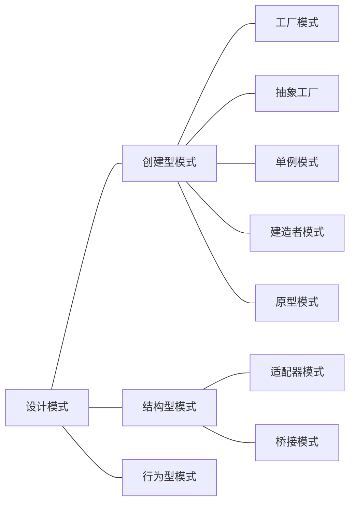

# 设计模式

## Creational Patterns（创建模式）

```mermaid
graph LR
设计模式 --- 创建型模式
创建型模式 --- 工厂模式
创建型模式 --- 抽象工厂
创建型模式 --- 单例模式
创建型模式 --- 建造者模式
创建型模式 --- 原型模式
设计模式 --- 结构型模式
结构型模式 --- 适配器模式
结构型模式 --- 桥接模式
设计模式 --- 行为型模式


```