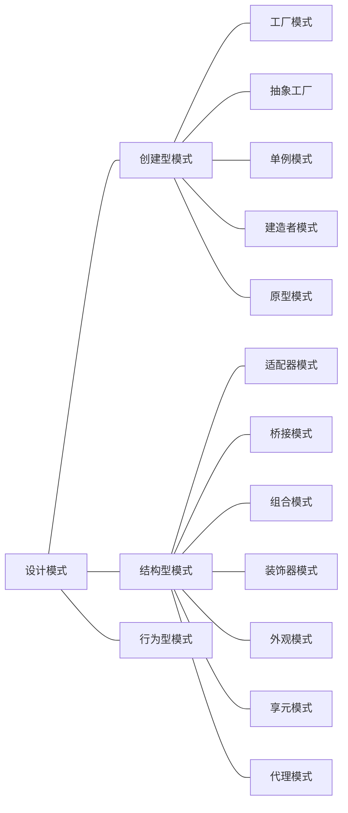

# 设计模式

## Creational Patterns（创建模式）

```mermaid
graph LR
设计模式 --- 创建型模式---工厂模式 & 抽象工厂 & 单例模式 & 建造者模式 & 原型模式
设计模式 --- 结构型模式
结构型模式 --- 适配器模式
结构型模式 --- 桥接模式
结构型模式 --- 组合模式
结构型模式 --- 装饰器模式
结构型模式 --- 外观模式
结构型模式 --- 享元模式
结构型模式 --- 代理模式
设计模式 --- 行为型模式


```