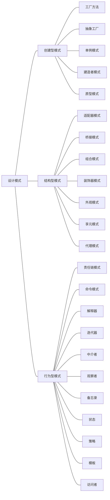

# 设计模式

```mermaid
graph LR
设计模式 --- 创建型模式---工厂方法 & 抽象工厂 & 单例模式 & 建造者模式 & 原型模式
设计模式 --- 结构型模式 --- 适配器模式 & 桥接模式 & 组合模式 & 装饰器模式 & 外观模式 & 享元模式 & 代理模式
设计模式 --- 行为型模式 --- 责任链模式 & 命令模式 & 解释器  & 迭代器 & 中介者 & 观察者 & 备忘录 & 状态 & 策略 & 模板 & 访问者
```

### 工厂方法（Factory Method）

```mermaid
classDiagram
Creator ...> Product

```