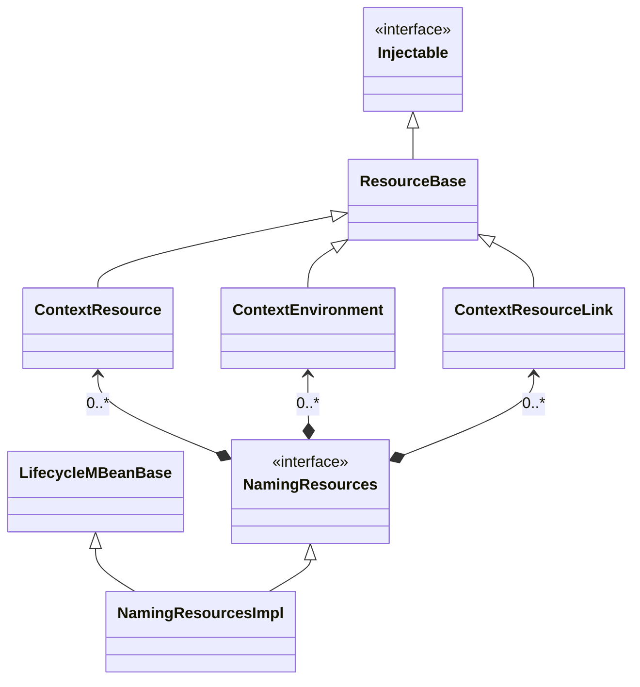

```mermaid
classDiagram
Injectable <|-- ResourceBase
ResourceBase <|-- ContextResource
ResourceBase <|-- ContextEnvironment
ResourceBase <|-- ContextResourceLink
ContextResource <--* NamingResources : 0..*
ContextEnvironment <--* NamingResources : 0..*
ContextResourceLink <--* NamingResources : 0..*
LifecycleMBeanBase <|-- NamingResourcesImpl
NamingResources <|-- NamingResourcesImpl
<<interface>> NamingResources
<<interface>> Injectable

```
+ ResourceBase
  资源基础类，每个类要有 description