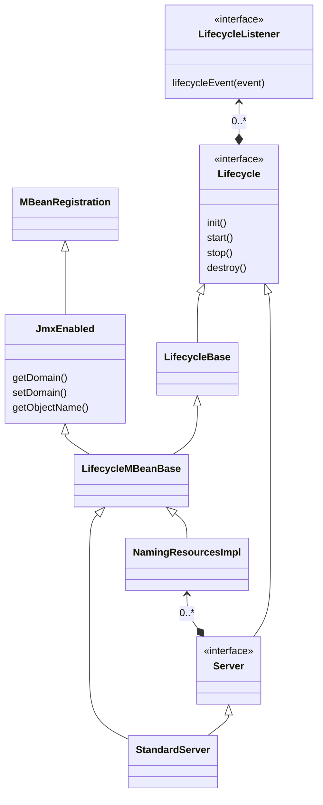

## 启动

## startup.sh

一般情况都是通过bin目录下“tartup.sh“启动，该启动脚本很简单，就是调用了“catalina.sh“时传递start参数，下面代码”$EXECUTABLE“的值为“catalina.sh“。
```bash
exec "$PRGDIR"/"$EXECUTABLE" start "$@"
```
## catalina.sh

初始化环境变量，并运行java启动tomcat，从脚本内容看可以在`setenv.sh`中自定义环境变量。通过调用`org.apache.catalina.startup.Bootstrap`类传入了start参数启动tomcat。

## org.apache.catalina.startup.Bootstrap
- 静态代码块

静态代码块初始化了一些变量如catalinaHomeFile， 和catalinaBaseFile

- init()
- initClassLoader

 此类里初始化了三个ClassLoader，分别是commonLoader、catalinaLoader和sharedLoader。commonLoader加载类的主要是base和home目录下的jar包中的class。catalinaLoader和sharedLoader的父lader时commonLoader，其配置分别为server.loader和share.loader.并将当前线程的classLoader设置为catalinaLoader。
 使用catalinaLoader加载类org.apache.catalina.startup.Catalina，调构造方法初始化示例catalinaDaemon，同事通过反射的方式调用setParentClassLoader方式，设置父classLoader为sharedLoader。然后通过反射调用catalinaDaemon的start方法启动tomcat。

- org.apache.catalina.startup.Catalina.start

start方法，首先调用了load方法。

- load
    + 初始化临时目录
    + 初始化Digester规则用于读取server.xml。Server.xml默认会从catalina.base/conf目录下读取。如果读取失败，则去classpath下去读取conf/server.xml, 还是读不到则尝试读取cataling.jar中的server-embed.xml。

- org.apache.catalina.core.StandardServer




```java
 *            start()
 *  -----------------------------
 *  |                           |
 *  | init()                    |
 * NEW -»-- INITIALIZING        |
 * | |           |              |     ------------------«-----------------------
 * | |           |auto          |     |                                        |
 * | |          \|/    start() \|/   \|/     auto          auto         stop() |
 * | |      INITIALIZED --»-- STARTING_PREP --»- STARTING --»- STARTED --»---  |
 * | |         |                                                            |  |
 * | |destroy()|                                                            |  |
 * | --»-----«--    ------------------------«--------------------------------  ^
 * |     |          |                                                          |
 * |     |         \|/          auto                 auto              start() |
 * |     |     STOPPING_PREP ----»---- STOPPING ------»----- STOPPED -----»-----
 * |    \|/                               ^                     |  ^
 * |     |               stop()           |                     |  |
 * |     |       --------------------------                     |  |
 * |     |       |                                              |  |
 * |     |       |    destroy()                       destroy() |  |
 * |     |    FAILED ----»------ DESTROYING ---«-----------------  |
 * |     |                        ^     |                          |
 * |     |     destroy()          |     |auto                      |
 * |     --------»-----------------    \|/                         |
 * |                                 DESTROYED                     |
 * |                                                               |
 * |                            stop()                             |
 * ----»-----------------------------»------------------------------
```

- org.apache.catalina.Lifecycle
   LifecycleBase类是Lifecycle的抽象实现，初始状态为LifecycleState.NEW。使用CopyOnWriteArrayList存储所有监听器。

   + init
    init未同步方法同步方法，非NEW状态下调用init方法会抛LifecycleException异常。然后设置状态为INITIALIZING，之后调用抽象方法initInternal，最后设置状态为INITIALIZED。每次设置状态是都会触发相应的生命周期事件。
   + start和stop
    start检查状态，如果已经为STARTED之前的状态则直接返回，如果为NEW则调用init方法，如果为FAILED则调用stop方法。然后一次设置状态为STARTING_PREP，调用抽象方法startInternal。然后检查值状态，如果为FAILED则调用stop方法，如果不是STARTING状态则抛出异常，正常情况下设置状态为STARTED。stop大致流程也是如此，中间检查状态是否为STOPPING。
    + destroy
    和init状态大致相反不再赘述。
- org.apache.catalina.util.LifecycleMBeanBase
    + initInternal初始化mserver，通过抽象方法getObjectNameKeyProperties获取注册objectNameKeyProperties，然后用':'拼接domain，注册到MbeanServer。

- org.apache.catalina.Server
    + Server接口继承了接口Lifecycle,主要又三个功能第一维护shutdown的地址、端口和命令；维护一个GlobalNamingResources和多个Service。