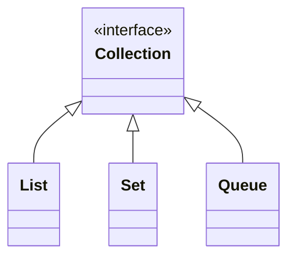

## Collection

集合类应该是java开发中使用最多类库之一，涉及的所有的类都在java.util包中。[Collection](https://docs.oracle.com/en/java/javase/13/docs/api/java.base/java/util/Collection.html)是集合类的最底层接口。通过链接可以查看详细信息

## 类图

## List
listIterator的用法

## Set